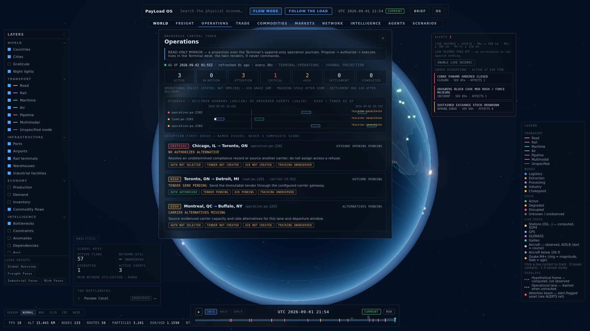
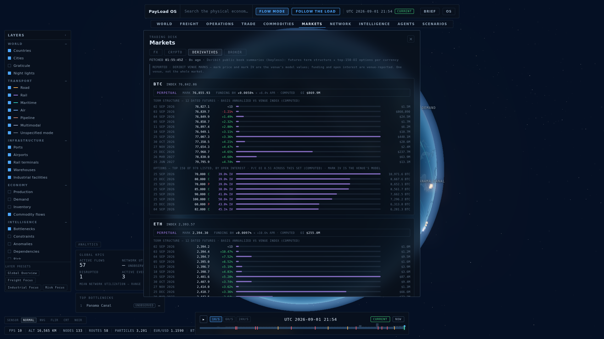
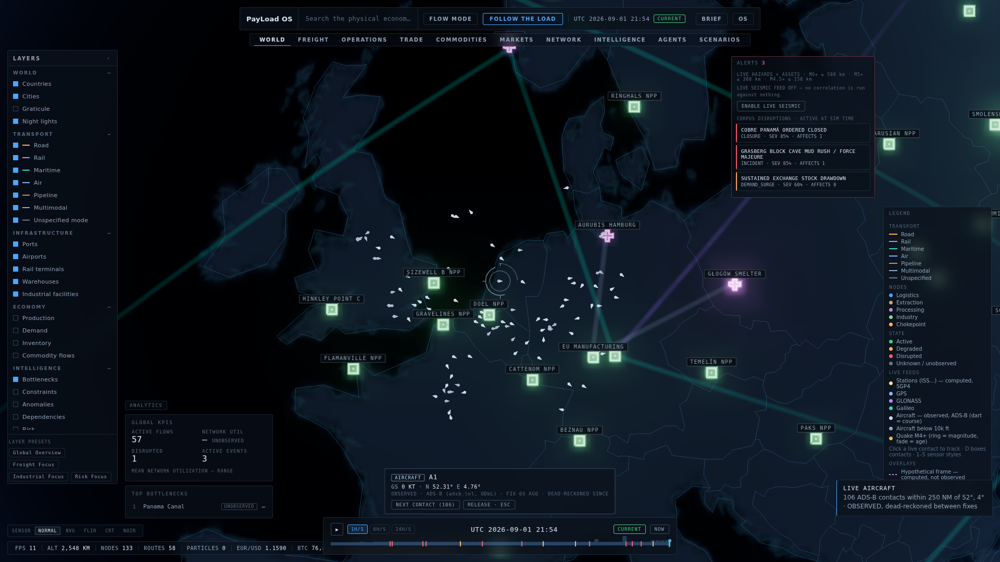

# PayLoad OS

**An interactive digital twin of the physical economy.**


| Night-side economy | Route inspector |
| --- | --- |
|  |  |

| Operations control tower | Derivatives desk | Live tracking |
| --- | --- | --- |
|  |  |  |

Payload Earth renders the machinery of trade — ports, rail terminals, refineries,
warehouses, chokepoints — on a dark, cinematic WebGL globe. Four transport modes
(road, rail, maritime, air) are drawn as first-class semantic routes; commodity
flows animate along them as GPU particle streams; a global timeline scrubs the
world through historical, current, and forecast state; an intelligence inspector
exposes every entity's promises, evidence, and deviations; and a single command
bar drives the whole instrument. It is built as a strict projection of Payload
state: the renderer draws the world, it never owns it.

It can also ask "what if": a deterministic counterfactual engine closes a
chokepoint and propagates the consequence — blocked lanes, starved downstream
facilities, corridor spillover, delayed flows — as an explicitly hypothetical
frame. Scenario frames carry `provenance.source: 'synthetic:scenario'`, render
in a distinct violet dashed treatment under a persistent banner, and switch the
clock to the `'scenario'` regime until cleared. They are never drawn in the
solid look of observed state: a simulated outcome is not an outcome. Because the
engine is pure, the SCENARIOS panel also ranks every chokepoint by simulated
queued delay without entering any frame — a criticality ranking that is computed
intelligence, never observation.

---

> ## DATA DISCLAIMER
>
> **Every record in this build is synthetic.** All entities carry
> `provenance.source: 'synthetic:demo'` — the same queryable field a real
> record will carry (`'external:ais'`, `'payload:spatial'`, ...). There are
> no real shipments, no real utilization figures, and no claims about the
> actual state of any facility or route. "Is this real?" is answered by
> querying the provenance field on the record itself, never by remembering
> which build you are looking at. The build fails if any record lacks a
> source (see `npm run check` below).

---

## Quickstart

```
npm install
npm run dev      # Vite dev server
npm run build    # runs check, then production build
npm run check    # seam + provenance + types
```

`npm run check` enforces three invariants and fails the build on any violation:

| Check | Script | What it enforces |
|---|---|---|
| Seam | `scripts/check-seam.mjs` | `src/data/**` is renderer-blind: no bare-module imports, no relative imports escaping the data layer (only the pure kernels `src/core/events.ts` and `src/core/time.ts` are allowed). |
| Provenance | `scripts/validate-provenance.mjs` | Executes the real synthetic dataset and fails on any record missing `provenance.source`. |
| Types | `tsc --noEmit` | TypeScript strict mode across the whole tree. |

## Controls & interaction

- **Drag** — rotate the globe
- **Wheel** — zoom (altitude drives level of detail and progressive disclosure)
- **Click** — select a facility, route, or flow; click a country to open its summary
- **Click a live contact** — track it: the camera chases the aircraft/satellite, a trail
  draws behind it, and a readout card carries its telemetry with its basis
  (OBSERVED ADS-B fix age, or COMPUTED SGP4 with TLE age). **Esc** releases.
- **Hold B** — route brush: sweep the cursor, nearby routes stay lit
- **D** — detection overlay: corner-bracket boxes + ids on every live contact in view
- **1–5** — sensor style over the rendered feed: NORMAL / NVG / FLIR / CRT / NOIR
  (a GLSL post-pass on the WebGL canvas only — instruments stay untouched)
- **Hover a live contact** — a tooltip identifies it before the click (name + basis)
- **`/`** — focus the command bar / search
- **Space** — play / pause simulation time
- **ALERTS rail** (top right) — live hazards correlated with corpus assets
  ("M5.6 · 240 km from Port of Callao"), labeled COMPUTED PROXIMITY with the
  correlation radii printed on the rail, plus the corpus's own active
  disruptions; click a row to focus the asset. With the seismic feed off the
  rail says so and offers the toggle — it never correlates against nothing.
- **Market pulse** (status bar) — EUR/USD (ECB daily fix) and BTC (Coinbase
  last trade), basis in the tooltip; absent, never zero, when the feed is down
- **Feed health** (status bar chip) — a session ledger of the last 20 attempt
  outcomes per feed ("markets.fx · 2/2 OK", "operations · refused 3 of last
  20"); click to expand. A feed never attempted is absent, not OK.
- **Search** is one fuzzy, ranked palette — verbs, layer toggles, presets, and
  corpus entities compete in a single scored list (diacritic-folded: `glog`
  finds Głogów)
- **Audio cue** (alerts rail, `CUE OFF/ON`) — opt-in, off by default: a short
  chime when a NEW alert-severity item appears; never for standing alerts.
  Preference remembered per browser.
- **Timeline density strip** — hover for the window's evidence readout
  ("2 observations known · 1 event start"), including the honest empty case
- Command examples: `find toronto` · `show maritime` · `show aircraft` · `follow the load`

## Layer reference

Layers are grouped as declared in `src/app/api.ts` (`LayerDef` / `LayerId`):

| Group | Layer ids |
|---|---|
| WORLD | `world.countries` · `world.cities` · `world.terrain` · `world.nightlights` |
| TRANSPORT | `transport.road` · `transport.rail` · `transport.maritime` · `transport.air` |
| INFRASTRUCTURE | `infra.ports` · `infra.airports` · `infra.rail_terminals` · `infra.warehouses` · `infra.industrial` |
| ECONOMY | `economy.production` · `economy.demand` · `economy.inventory` · `economy.flows` |
| INTELLIGENCE | `intel.bottlenecks` · `intel.constraints` · `intel.anomalies` · `intel.dependencies` · `intel.risk` |
| LIVE | `live.satellites` · `live.aircraft` · `live.seismic` |

## Command reference

The command bar accepts a small, forgiving grammar (`src/app/commands.ts`).
Main verbs:

| Command | Effect |
|---|---|
| `find <name>` / `goto <name>` | Search entities and cinematically focus the best match. Bare text falls through to search. |
| `show <layer>` / `hide <layer>` | Toggle a layer by alias (`maritime`, `ports`, `bottlenecks`, ...). `show everything`, `show corridors` toggle groups. |
| `show <commodity> flows` | Match flows by commodity (e.g. `show copper flows`), enable flow mode, focus the first match. |
| `flows on` / `flows off` | Toggle flow-particle mode. |
| `play` / `pause` / `now` | Simulation clock control; `now` jumps to the dataset's regime boundary. |
| `speed 1h` / `speed 6h` / `speed 24h` | Sim-hours per wall-second. |
| `compare <a> vs <b>` | Compare two routes: distance, promised duration, live utilization. |
| `world` / `freight` / `trade` / `commodities` / `network` / `intelligence` | View presets (`exceptions` remains a legacy alias for `intelligence`). |
| `agents` / `scenarios` / `markets` | Panel views: no layer change, they open an instrument panel (the AGENTS, SCENARIOS and MARKETS tabs). |
| `what if <chokepoint> closes` / `scenario <name>` | Enter a hypothetical frame (e.g. `what if suez closes`); `exit frame` returns to observed state. |
| `rank chokepoints` / `criticality` | Rank every catalog frame by simulated queued delay without entering any — computed intelligence, never observation. Opens the SCENARIOS panel. |
| `follow the load` | Cinematic multimodal demo scenario; `stop` / `exit` ends it. |
| `help` | Print the verb summary. |

Counterfactuals run from the SCENARIOS panel (`scenarios`) or straight from the
command bar (`what if suez closes`): pick a chokepoint closure and enter the
hypothetical frame — the regime becomes `'scenario'`, the impact renders in the
violet dashed scenario treatment with a persistent banner, and `exit frame`
returns to observed state.

## Markets (trading desk)

The MARKETS tab opens the trading-desk workspace: FX, crypto, crypto
derivatives, and the broker seam, served through the spatial API's markets
proxy (`server/markets.mjs` — hosts fixed in code, cached with stated TTLs
and ages, typed refusals with remedies). Every desk leads with its basis,
and every figure the panel derives (a % change, an annualized basis, a
funding APR, a put/call ratio) is labeled COMPUTED in text:

| Desk | Upstream (keyless) | Basis shown in the UI |
|---|---|---|
| FX | ECB daily reference rates via api.frankfurter.dev | REPORTED · daily fix with its date — informational, **not a tradeable quote** |
| CRYPTO | Coinbase Exchange public market data | OBSERVED · single-venue prints (last trade, 24h stats, daily closes) — venue truth, not an index |
| DERIVATIVES | Deribit public book summaries (BTC, ETH) | REPORTED · venue marks — futures term structure with COMPUTED annualized basis, perpetual funding (+ COMPUTED APR), top-OI options with the venue's mark IV |
| BROKER | Interactive Brokers Client Portal Gateway | fail-closed adapter seam — see below |

**Broker posture.** The BROKER desk is a read-only adapter seam for
Interactive Brokers' Client Portal API: it renders `BROKER_NOT_CONFIGURED`
with a remedy until `IBKR_GATEWAY_URL` points at a running, authenticated
gateway. Credentials live in the gateway, never in this service and never
in a browser. **No order capability exists on this surface by design** —
order execution belongs to the Terminal backend under its own authority
model; this desk mirrors session state the way the operations desk mirrors
the control tower.

## Live substrate (gods-eye-view, under PayLoad OS chrome)

The LIVE layer group carries real public feeds, adapted from
[bilawalsidhu/gods-eye-view](https://github.com/bilawalsidhu/gods-eye-view) (MIT —
see [`docs/ATTRIBUTIONS.md`](docs/ATTRIBUTIONS.md)) and served through the
spatial API's keyless proxy (`server/live.mjs`; upstream hosts fixed in code,
disk-cached, response-capped). A public feed is never conflated with the loaded
corpus: live records carry their own source class, disclaimer, and basis.

Working today, no keys required:

| Feed | Upstream | Basis shown in the UI |
|---|---|---|
| Satellites (ISS + GNSS shells, true-scale orbits) | celestrak elements | COMPUTED · SGP4, repropagated 1/s, TLE age stated |
| Aircraft (250 NM around the camera subpoint) | adsb.lol (ODbL) | OBSERVED · ADS-B fix, dead-reckoned ≤180 s between fixes, fix age stated |
| Seismic (M2.5+, 24 h) | USGS | REPORTED · report time, ring fades with age |

**Power-up ladder** — features that exist in the codebase or design but stay
dark until a key or account is configured. A missing key is a typed refusal
with a remedy, never a faked surface:

| Power-up | Needs | Status |
|---|---|---|
| Interactive Brokers desk | IB Client Portal Gateway running + `IBKR_GATEWAY_URL` | Adapter seam implemented (`/api/markets/broker`); refuses with the remedy until configured; read-only by design |
| Active fires overlay | `FIRMS_MAP_KEY` (free: https://firms.modaps.eosdis.nasa.gov/api/map_key/) | Proxy route implemented (`/api/live/fires`); refuses with the remedy until keyed |
| Live vessels (AIS) | AISStream account/key | Documented design; not implemented until a key path exists |
| Voice control | OpenAI realtime key | Not implemented; the command bar is the hands-on equivalent |
| Photoreal 3D tiles | Cesium ion / Google tiles key | Not implemented; the procedural globe is the keyless default |

## Architecture

The engineering record — the data/render seam, provenance discipline, the
Assertion/Observation/Deviation model, the provider interface, the rendering
pipeline, and the temporal model — lives in
[`docs/ARCHITECTURE.md`](docs/ARCHITECTURE.md).

The **design language** — the semantic vocabulary (solid=observed,
hollow=declared, dashed=hypothetical, absence stated), palette, z-bands,
interaction grammar, and the honesty rule of every surface — lives in
[`docs/DESIGN.md`](docs/DESIGN.md).

## License

GNU General Public License v3.0 — see [`LICENSE`](LICENSE).
