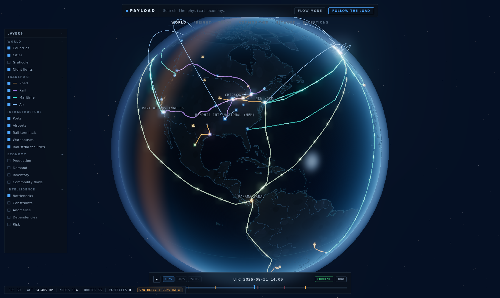
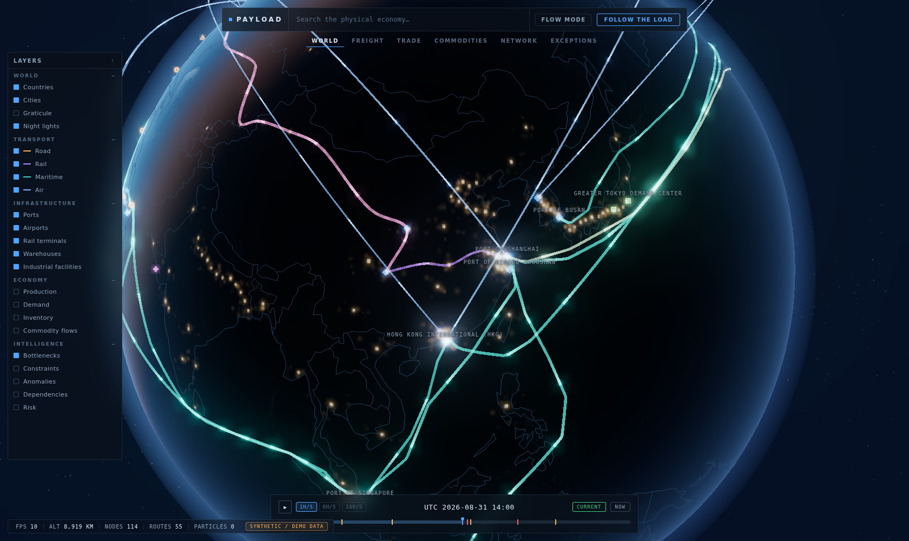
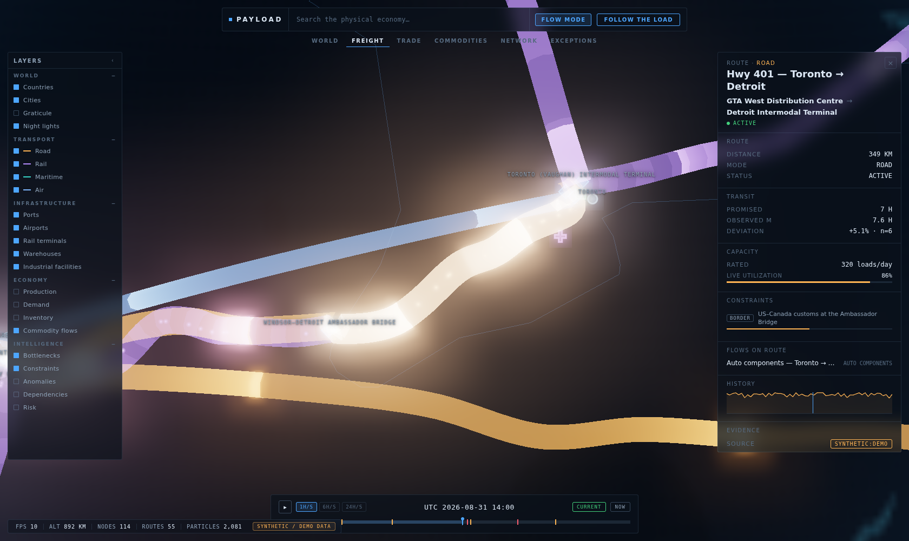

# PAYLOAD EARTH

**An interactive digital twin of the physical economy.**



| Night-side economy | Route inspector |
| --- | --- |
|  |  |

Payload Earth renders the machinery of trade — ports, rail terminals, refineries,
warehouses, chokepoints — on a dark, cinematic WebGL globe. Four transport modes
(road, rail, maritime, air) are drawn as first-class semantic routes; commodity
flows animate along them as GPU particle streams; a global timeline scrubs the
world through historical, current, and forecast state; an intelligence inspector
exposes every entity's promises, evidence, and deviations; and a single command
bar drives the whole instrument. It is built as a strict projection of Payload
state: the renderer draws the world, it never owns it.

---

> ## DATA DISCLAIMER
>
> **Every record in this build is synthetic.** All entities carry
> `provenance.source: 'synthetic:demo'` — the same queryable field a real
> record will carry (`'external:ais'`, `'payload:spatial'`, ...). There are
> no real shipments, no real utilization figures, and no claims about the
> actual state of any facility or route. "Is this real?" is answered by
> querying the provenance field on the record itself, never by remembering
> which build you are looking at. The build fails if any record lacks a
> source (see `npm run check` below).

---

## Quickstart

```
npm install
npm run dev      # Vite dev server
npm run build    # runs check, then production build
npm run check    # seam + provenance + types
```

`npm run check` enforces three invariants and fails the build on any violation:

| Check | Script | What it enforces |
|---|---|---|
| Seam | `scripts/check-seam.mjs` | `src/data/**` is renderer-blind: no bare-module imports, no relative imports escaping the data layer (only the pure kernels `src/core/events.ts` and `src/core/time.ts` are allowed). |
| Provenance | `scripts/validate-provenance.mjs` | Executes the real synthetic dataset and fails on any record missing `provenance.source`. |
| Types | `tsc --noEmit` | TypeScript strict mode across the whole tree. |

## Controls & interaction

- **Drag** — rotate the globe
- **Wheel** — zoom (altitude drives level of detail and progressive disclosure)
- **Click** — select a facility, route, or flow; click a country to open its summary
- **`/`** — focus the command bar / search
- **Space** — play / pause simulation time
- Command examples: `find toronto` · `show maritime` · `show bottlenecks` · `follow the load`

## Layer reference

Layers are grouped as declared in `src/app/api.ts` (`LayerDef` / `LayerId`):

| Group | Layer ids |
|---|---|
| WORLD | `world.countries` · `world.cities` · `world.terrain` · `world.nightlights` |
| TRANSPORT | `transport.road` · `transport.rail` · `transport.maritime` · `transport.air` |
| INFRASTRUCTURE | `infra.ports` · `infra.airports` · `infra.rail_terminals` · `infra.warehouses` · `infra.industrial` |
| ECONOMY | `economy.production` · `economy.demand` · `economy.inventory` · `economy.flows` |
| INTELLIGENCE | `intel.bottlenecks` · `intel.constraints` · `intel.anomalies` · `intel.dependencies` · `intel.risk` |

## Command reference

The command bar accepts a small, forgiving grammar (`src/app/commands.ts`).
Main verbs:

| Command | Effect |
|---|---|
| `find <name>` / `goto <name>` | Search entities and cinematically focus the best match. Bare text falls through to search. |
| `show <layer>` / `hide <layer>` | Toggle a layer by alias (`maritime`, `ports`, `bottlenecks`, ...). `show everything`, `show corridors` toggle groups. |
| `show <commodity> flows` | Match flows by commodity (e.g. `show copper flows`), enable flow mode, focus the first match. |
| `flows on` / `flows off` | Toggle flow-particle mode. |
| `play` / `pause` / `now` | Simulation clock control; `now` jumps to the dataset's regime boundary. |
| `speed 1h` / `speed 6h` / `speed 24h` | Sim-hours per wall-second. |
| `compare <a> vs <b>` | Compare two routes: distance, promised duration, live utilization. |
| `world` / `freight` / `trade` / `commodities` / `network` / `exceptions` | View presets. |
| `follow the load` | Cinematic multimodal demo scenario; `stop` / `exit` ends it. |
| `help` | Print the verb summary. |

## Architecture

The engineering record — the data/render seam, provenance discipline, the
Assertion/Observation/Deviation model, the provider interface, the rendering
pipeline, and the temporal model — lives in
[`docs/ARCHITECTURE.md`](docs/ARCHITECTURE.md).

## License

GNU General Public License v3.0 — see [`LICENSE`](LICENSE).
